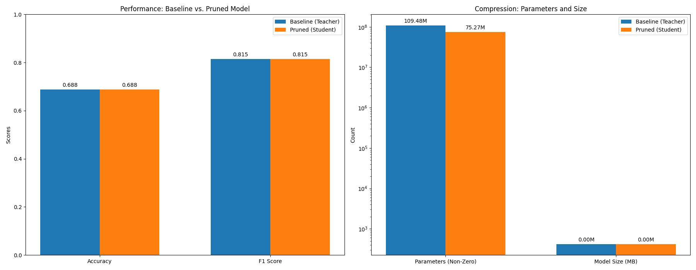

# Hebbian-Inspired Iterative Pruning for Transformers

This repository contains a Python script (`main.py`) that experiments with a "Hebbian-inspired" iterative pruning technique for compressing Hugging Face Transformer models. The core idea is to identify and remove weights that are least important, as measured by the magnitude of their gradients during training. This is followed by a knowledge distillation phase to recover performance.

The term "Hebbian-inspired" is used because the pruning metric (gradient magnitude) is a proxy for synaptic importance, akin to how Hebbian theory suggests that more active neural pathways are strengthened.

## The Approach

The experiment follows these steps:

1.  **Baseline Training**: A standard `bert-base-uncased` model is fine-tuned on the GLUE MRPC dataset. This serves as our "teacher" model and performance baseline.
2.  **Importance Scoring**: A second, identical model (the "student") is briefly fine-tuned. A forward and backward pass is performed on a batch of data to calculate the gradients for each weight. The absolute value of these gradients is used as an *importance score*.
3.  **Pruning**: The student model's linear layers are pruned using `torch.nn.utils.prune.l1_unstructured`. A specified percentage (e.g., 40%) of the weights with the lowest importance scores are masked to zero. This pruning is made permanent.
4.  **Knowledge Distillation**: The pruned student model is then trained further. However, instead of using only the standard cross-entropy loss, the loss function is a combination of cross-entropy and a distillation loss (Kullback–Leibler divergence) that encourages the student's output logits to match the teacher's. This helps the smaller model learn the "dark knowledge" from the larger teacher, often recovering much of the performance lost during pruning.
5.  **Evaluation and Visualization**: Finally, the performance (Accuracy, F1 score) and size (non-zero parameters, disk size) of the pruned student model are compared against the original teacher model, with results visualized in a plot.

## Results

After running the experiment, a `pruning_results.png` plot is generated. The expected outcome is:

* **Performance**: The pruned model's accuracy and F1 score will be slightly lower than the baseline teacher model, but still very competitive. Knowledge distillation is key to minimizing this performance gap.
* **Compression**: The pruned model will have significantly fewer non-zero parameters and a smaller file size, demonstrating the effectiveness of the compression technique.


*(This image will be generated when you run the script)*

## How to Run

### 1. Setup Environment

It's recommended to use a virtual environment. You will need Python 3.8+ and a GPU with CUDA to run this efficiently.

```bash
# Clone the repository
git clone <your-repo-link>
cd <your-repo-name>

# Create and activate a virtual environment
python -m venv venv
source venv/bin/activate  # On Windows, use `venv\Scripts\activate`

# Install required packages
pip install torch transformers datasets evaluate scikit-learn matplotlib
```

### 2. Run the Experiment

Simply execute the main script. All configuration is handled within the `if __name__ == "__main__":` block.

```bash
python main.py
```

The script will download the model and dataset, then proceed through the training, pruning, and distillation steps. This may take some time depending on your hardware. Log messages will keep you updated on the progress.

### 3. Customization

You can easily change the experiment's parameters at the bottom of `main.py`:

* `MODEL_NAME`: Use a different Hugging Face model (e.g., `'distilbert-base-uncased'`).
* `DATASET_NAME` / `DATASET_TASK`: Try another dataset from the GLUE benchmark or elsewhere.
* `PRUNE_PERCENT`: Adjust the sparsity level. Increase it for more compression, but at the risk of lower accuracy.